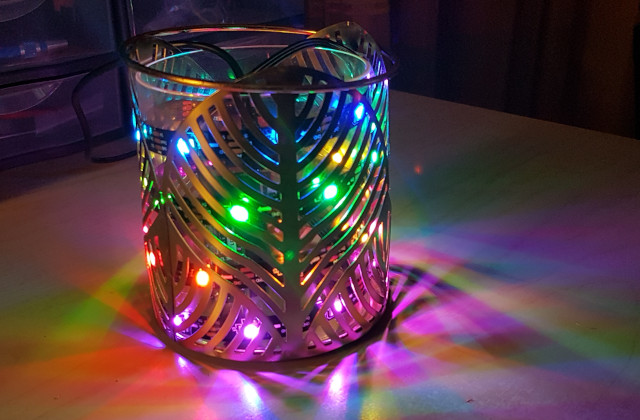
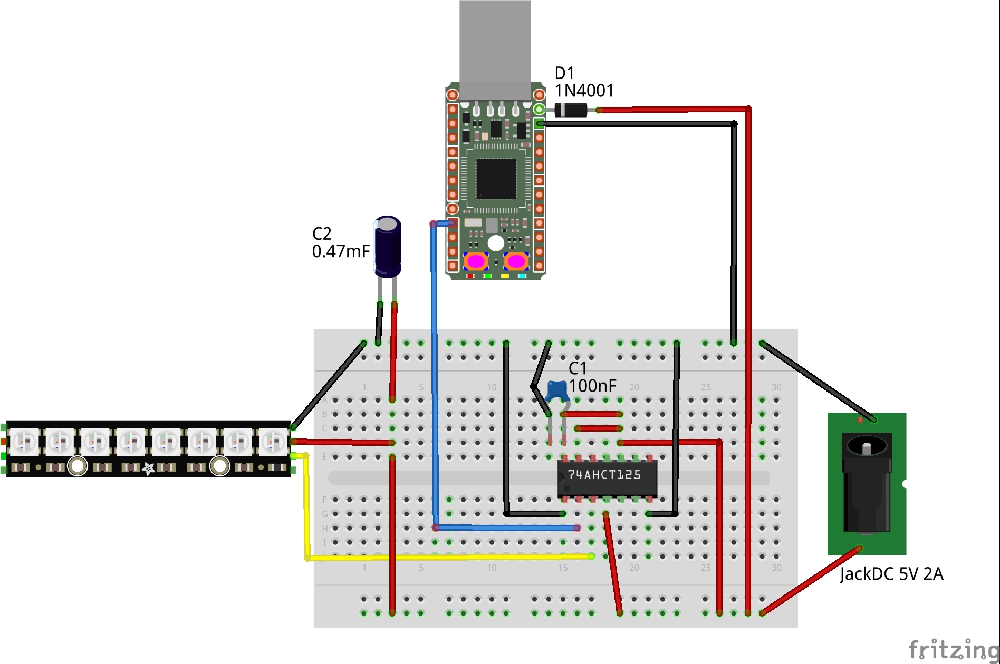
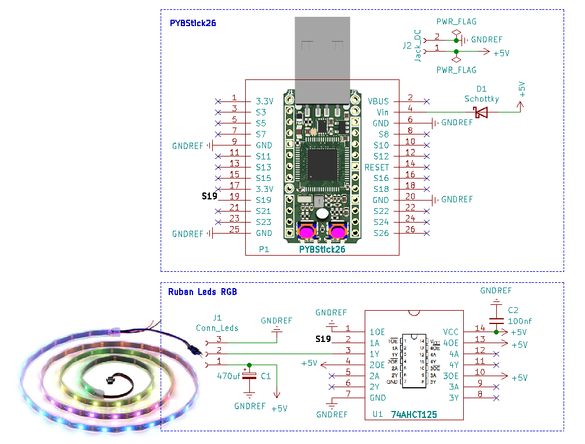
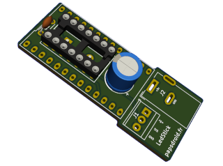

# ledStick

Tutoriel complet sur https://www.papsdroid.fr/post/ledstick

## contrôle d'un ruban de leds RGB avec une PYBStick26
 
  
 
 Source du projet d'animation d'un ruban de Leds RGB neopixels avec un micro-contrôleur  MicroPython PYBStick26.
 
 ## prototype sur breadboard
  
 
 ## carte d'extension pour la PYBStick26
  
  
  

https://www.papsdroid.fr/post/ledstick

