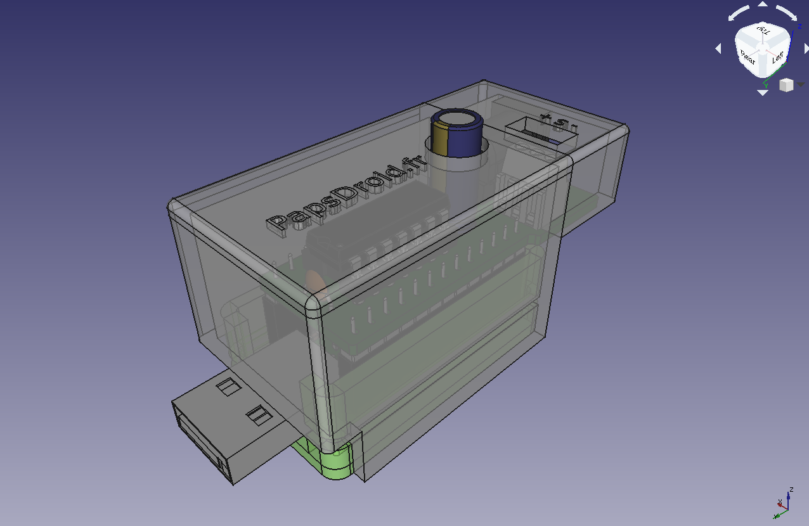
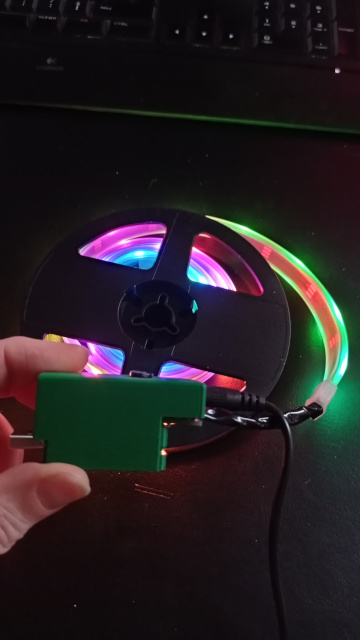

# ledStick

Tutoriel complet sur https://www.papsdroid.fr/post/ledstick

## contrôle d'un ruban de leds RGB avec une PYBStick26
 
  
 
 Source du projet d'animation d'un ruban de Leds RGB neopixels avec un micro-contrôleur  MicroPython PYBStick26.
 
 ## prototype sur breadboard
  

>**Attention!** le ruban est très fragile: ne pas se tromper avec les voltages (alimentation 5v) et avec les polarités, sinon il est mort direct.

Pour animer le ruban de leds: recopier les 3 fichiers sur le lecteur PYBFLASH qui apparaît lorsque vous branchez la PYBStick26 sur un port USB de votre ordinateur.
* main.py : script principal 
* rubanLeds.py : animation du ruban de leds
* ws2812.py: bilbiothèque de contrôle de leds RGB Neopixels, conçue par [MCHobby](https://github.com/mchobby/pyboard-driver/tree/master/PYBStick) 

 Déconnectez la PYBStick26, puis branchez l'alimentation Jack DC 5v: le ruban de leds s'anime immédiatement.
 
 ## carte d'extension pour la PYBStick26
  
  
  
 Pour fabriquer la carte d'extension chez n'importe quel fabriquant de PCB: utilisez les fichiers GERBER zippés (GERBER_LedStick_v1.1.zip)

Guide de montage sur: https://www.papsdroid.fr/post/ledstick

## Boitier imprimé 3D

Un modèle de boitier 3D est modélisé en 2 parties qui se clipsent l'une sur l'autre. Les fichiers STL sont disponibles dans le dossier **/Boitier3D**
Il faut disposer la partie haute verticalement sur la partie basse en jouant sur l'élasticité des bords de la pièce pour faire rentrer de force la rainure dans son logement. Utilisez un petit tournevis plat pour aider: quand ça fait "clac!" tout est en place.

